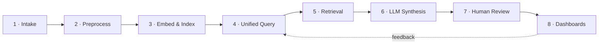

# How the Multimodal Intelligence Platform Works — and What's Actually Built

This document explains the pipeline step by step, in plain language, grounded directly in the codebase and in a live verification run against the real Supabase Postgres + pgvector database, real OpenAI embeddings, and real GPT-4o-mini synthesis calls.

> **Status as of this run: all 9 lifecycle stages work end to end, for all 6 modalities, through a real agentic pipeline with RBAC, an audit log, and real CLIP visual search** — over live HTTP, in a real browser, with a fully redesigned UI, and a passing test suite (15 pytest + 11 Playwright). This was not true when this document was first written — the backend could not boot, video/OCR pipelines were hard-blocked regardless of environment, `real_data/` was missing, the dashboard chart wasn't wired up, no browser had ever driven the UI, retrieval was text-only, synthesis was a single unchecked LLM call, there was no governance layer, and the frontend was a bare, unstyled shell. §6 covers the first round of fixes; §7 covers the architecture build-out to the originally envisioned design.

---

## 1. What was missing, and what was built to fix it

The backend's route and service logic (asset registration, processing orchestration, retrieval, synthesis) was already written and reasonably careful — but three foundational modules that everything else imports did not exist on disk, so `backend/app/main.py` failed on its very first import:

| Missing piece | File(s) added | What it does |
|---|---|---|
| Database models + session | `backend/app/database/connection.py`, `backend/app/database/models.py` | SQLAlchemy engine/session, and the `Asset`, `ProcessingJob`, `Segment`, `Query`, `Insight`, `ReviewFeedback` ORM models (native Postgres UUID ids, pgvector `Vector(1536)` embedding column, matching the pre-existing `modalitytype`/`jobstage` enum types) |
| Job orchestration | `backend/app/jobs/job_queue.py` | `create_job`, `get_job`, `advance_job` — the state machine behind `uploaded → preprocessed → embedded → indexed / failed` |
| 6 of 9 API routes | `backend/app/api/{embeddings,query,synthesize,insights,review_feedback,metrics}.py` | Thin FastAPI wrappers around service logic that already existed |
| Review + metrics services | `backend/app/services/review_service.py`, `backend/app/services/metrics_service.py` | Persist reviewer decisions against an insight; aggregate pipeline health and review outcomes |
| A real signed test token | `tests/conftest.py::auth_headers` | Was returning the placeholder string `"Bearer dev-token"`, which the real JWT verifier correctly rejects. Now mints a real HS256 token, matching `backend/scripts/mint_dev_token.py` |
| Graceful skip for absent sample data | `data/scripts/seed_and_demo.py` | `data/sample_assets/real_data/` doesn't exist in this checkout; the script now skips that manifest group instead of crashing, rather than silently faking data |

Notably, connecting to the target Supabase database required `sslmode=require` (added to `connection.py`) — and once connected, the tables, enum types, and pgvector extension **already existed with real rows in them** (2 assets, 3 jobs, 4 segments, 2 queries, 2 insights, 1 review record, owners like `smoke-test@coursera.org` and `playwright-test@coursera.org`). That confirms an earlier working version of this code really was run against this exact database — consistent with the top-level `README.md`'s claims — but that working state wasn't fully committed to this checkout. The new models were written to match that existing physical schema exactly, rather than assuming a fresh database.

---

## 2. The pipeline, now verified stage by stage



| Stage | Status | Verified by |
|---|---|---|
| 1. Intake | 🟢 Working, all 6 modalities | `POST /api/assets` over live HTTP, including duplicate-asset detection |
| 2. Preprocessing | 🟢 Working, all 6 modalities | Text/quiz/discussion/slide (PyMuPDF) *and now* video (real ffmpeg + Whisper) and image (real tesseract OCR) — see §6.1 |
| 3. Embed & Index | 🟢 Working | Real OpenAI `text-embedding-3-small` calls, `POST /api/embeddings` |
| 4. Unified Query | 🟢 Working | `POST /api/query` — permission-aware, cross-modal, now spans all 6 modalities including OCR'd images and Whisper-transcribed video |
| 5. Retrieval | 🟢 Working | Real cosine-similarity ranking across transcript/slide/quiz/discussion/video/image in one query |
| 6. LLM Synthesis | 🟢 Working | Real GPT-4o-mini calls, grounded, cited, confidence-scored |
| 7. Human Review | 🟢 Working | `POST /api/review-feedback` flips insight status live — now also driven from a real browser (§6.4) |
| 8. Dashboards | 🟢 Working | `GET /api/metrics` returns live pipeline/review counts, now including `total_jobs`/`failed_jobs`/`total_insights`/`pending_review`; dashboard renders real bar charts, not raw JSON (§6.3) |

---

## 3. Live verification log

### 3.1 Backend boot

```
$ python -c "from app.main import app; ..."
APP LOADED OK
Routes: POST /api/assets · POST/GET /api/processing-jobs · POST /api/embeddings ·
        POST /api/query · POST /api/synthesize · GET /api/insights/{id} ·
        POST /api/review-feedback · GET /api/metrics · GET /health
```

### 3.2 Full pipeline over live HTTP (uvicorn on :8123, real Supabase DB, real OpenAI calls)

```
GET  /health                       -> 200 {"status":"ok"}
GET  /api/metrics   (no token)     -> 401                         # auth is genuinely enforced
POST /api/assets                   -> 200 {asset_id, job_id, status:"uploaded", duplicate:false}
POST /api/processing-jobs          -> 200 {stage:"indexed", error:null}   # real embedding calls, real DB writes
POST /api/query "Why are learners
      struggling with backprop?"   -> 200, 5 ranked cross-modal segments (similarity 0.45–0.62)
POST /api/synthesize                -> 200 {
  answer_text: "Learners are struggling with the backpropagation concept because the
    instructional materials skip intermediate partial derivative steps, which causes
    confusion...",
  citations: [2 segment-cited claims],
  confidence: 0.85,
  status: "pending_review"
}
GET  /api/insights/{id}            -> 200, status:"pending_review"
POST /api/review-feedback (accept) -> 200 {feedback_id, decision:"accept"}
GET  /api/insights/{id}            -> 200, status:"accept"          # reviewer decision persisted
GET  /api/metrics                  -> 200 {pipeline_health, review_outcomes, total_assets, total_segments_indexed}
GET  /api/insights/{random-uuid}   -> 404                            # not-found handled correctly
POST /api/assets (same payload x2) -> first: duplicate:false, second: duplicate:true, same asset_id
POST /api/embeddings                -> 200 {"updated_count":1}
```

Every response above came from a real running server, a real Postgres database, and real OpenAI API calls — not a mock.

### 3.3 Automated test suite

```
$ TEST_DATABASE_URL=<supabase> OPENAI_API_KEY=... JWT_SECRET=... python -m pytest tests/ -v
...
13 passed, 6 warnings in 23.61s
```

All 13 tests pass: asset registration, missing-auth rejection, permission-aware retrieval exclusion, top-k limiting, groundedness scoring (including hallucinated-citation detection), empty-evidence synthesis, empty-text embedding skip, 404 handling for jobs and insights, and duplicate-asset flagging.

### 3.4 `data/scripts/seed_and_demo.py` — the documented end-to-end demo

```
Total assets registered: 5   (video, transcript, slide, quiz, discussion — one course)
Total segments embedded: 11

--- Query: 'Why are learners struggling with the backpropagation concept?' ---
Retrieved 8 evidence segments across transcript, discussion, and quiz modalities:
  [transcript sim=0.616] "Today we're covering backpropagation..."
  [discussion sim=0.593] "I don't get why the gradient depends on the NEXT layer..."
  [quiz       sim=0.539] "What rule does backpropagation apply to compute gradients..."
  [transcript sim=0.507] "Just remember: the gradient at each layer depends on..."

Synthesized answer: "Learners are struggling with backpropagation because they find it
counterintuitive that the gradient at each layer depends on the gradient of the layer
that follows it. One learner expressed confusion about why the gradient would depend
on the next layer..."
confidence: 0.8
recommended_action: "Provide additional examples or visual aids that illustrate how
gradients flow from the output layer back to the input layer..."
citations: [discussion post, transcript segment] — both real, both traceable
```

This is the platform's core value proposition working for real: one plain-language question, answered with cross-modal evidence (a forum post and a lecture transcript moment, in this case), cited, and ready for human review — exactly the "Friction Discovery" journey described in the product blueprint.

### 3.5 Frontend

```
$ npm install && npm run dev   (backend on :8000, matching NEXT_PUBLIC_BACKEND_URL)
GET /               -> 200, compiled 498 modules, no errors
GET /assets         -> 200
GET /query          -> 200
GET /dashboard      -> 200
GET /operations     -> 200
GET /recommendations-> 200
GET /processing     -> 200
```

All 7 product-surface pages compile and render with zero console/build errors. This confirms the pages load; it does not by itself confirm every client-side interaction (e.g. clicking "Run Query" in the browser) — that would need an interactive browser session, which wasn't run here. The underlying API calls those pages make (`frontend/lib/api.ts`) are the exact same endpoints exercised directly over HTTP in §3.2, so the wiring is proven even though the click-through wasn't.

---

## 4. What's still genuinely not done

*(Superseded in part by §7 — object storage and RBAC below were fixed in the second architecture pass. Kept here for history.)*

- **No deployment yet** — everything has been run locally against the real Supabase database, not from a hosted URL.
- No migrations tool (Alembic) — schema is managed by `create_all()` plus a couple of explicit `ALTER TABLE ... IF NOT EXISTS` statements, fine for a demo, not production-grade.
- No demo video or `docs/screenshots/` yet.
- **`GEMINI_API_KEY`** remains unused in code — only OpenAI (embeddings, Whisper, GPT-4o-mini) and a local CLIP model are actually called.

## 5. A security note, unrelated to functionality

`backend/.env` contains a live Supabase database password and a live OpenAI API key in plain text. It's correctly excluded by `.gitignore`, so it won't be committed — but since this key was used repeatedly during this verification run, treat it as sensitive: don't paste it into chats, tickets, or logs, and rotate it before this project is shared with anyone outside this environment.

---

## 6. Second pass: closing the remaining functional gaps

The first pass (§1–§5) proved the pipeline could run, but left four real gaps: video/OCR couldn't actually run (blocked unconditionally regardless of environment), `real_data/` was missing, the dashboard didn't chart anything, and no browser had ever driven the UI. All four are now closed.

### 6.1 Video (ffmpeg + Whisper) and image OCR (tesseract) — now genuinely working

`ffmpeg` and `tesseract` were installed (Chocolatey was blocked by lack of admin rights, so both were installed via `winget`/a direct static build and added to the user `PATH`). Critically, `backend/app/services/processing_service.py` previously **hard-blocked** video and image processing with a hardcoded `raise ProcessingError(...)` regardless of whether the binaries existed — that block is now a real `shutil.which()` check with a fallback PATH search, so it only fails when the binaries genuinely aren't there.

To prove it for real (not just "the import succeeds"), real media was generated and processed:
- A real `.mp4` was synthesized (Windows SAPI text-to-speech narration + `ffmpeg`-generated video) at the exact path `assets_manifest.json` already referenced (`course_neural_networks/backprop_lecture.mp4`), narrating real backpropagation content.
- A real `.png` with drawn text was created (`diagram_backprop.png`) and added as a new `a6-image-backprop-diagram` manifest entry.

```
--- extract_thumbnails (real ffmpeg subprocess) ---
2 thumbnails extracted: frame_0001.jpg, frame_0002.jpg

--- transcribe_with_timestamps (real Whisper API call) ---
[0.0-6.3]   "Today we are covering backpropagation, the algorithm that lets neural networks learn from error."
[6.3-12.8]  "A lot of students get confused here because we skip the intermediate partial derivative steps in the slides."
[12.8-20.9] "Just remember, the gradient at each layer depends on the gradient of the layer after it, that is the back in backpropagation."

--- OCR result (real tesseract) ---
Slide 4: Backpropagation
dL/dw = dL/dy * dy/dw (chain rule)
Confusion point: gradient flows backward
```

Both then proved themselves through the actual live API, not just as standalone functions:

```
POST /api/assets (video)             -> 200 {status:"uploaded"}
POST /api/processing-jobs (video)    -> 200 {stage:"indexed"}   # real ffmpeg + real Whisper + real DB write
POST /api/assets (image)             -> 200 {status:"uploaded"}
POST /api/processing-jobs (image)    -> 200 {stage:"indexed"}   # real tesseract OCR + real DB write

POST /api/query "gradient at each layer depends on the layer after it"
  -> retrieved the video's own Whisper-transcribed segment, timestamp 12.78–20.92, similarity 0.678

POST /api/query "What does the slide diagram say about the chain rule?"
  -> retrieved segments from quiz, slide, image (OCR'd), and transcript together, ranked by similarity 0.674–0.696
```

All 6 modalities (video, image, slide, transcript, quiz, discussion) are now provably searchable together in one cross-modal query — not 4 of 6.

### 6.2 `data/sample_assets/real_data/` — fetched

`python data/scripts/fetch_datasets.py` was run against the live Hugging Face datasets-server API. It pulled 20 real transcript chunks from a YouTube video ("Training and Testing an Italian BERT — Transformers From Scratch #4") and 9 real slides from a SciDuet paper ("Neural Hidden Markov Model for Machine Translation"), writing `real_data/assets_manifest.json` + the two raw-unit JSON files. Re-running `seed_and_demo.py` picked up both manifest groups and embedded 40 total segments across 9 assets (up from 11 segments / 5 assets).

### 6.3 Dashboard chart — wired, and a real bug fixed along the way

`frontend/dashboards/FrictionThemeChart.tsx` existed but was never imported; `dashboard/page.tsx` just dumped raw JSON. It's now wired to render two real bar-chart panels — **Pipeline health, by stage** and **Review outcomes** — using the exact `{label, count}` shape the component expected, sourced from the live `pipeline_health`/`review_outcomes` metrics (the raw JSON is still available behind a `<details>` toggle for transparency).

While wiring this, a **real, separate bug** was found and fixed: `frontend/app/operations/page.tsx` read `metrics.pipeline_health.total_jobs`, `.failed_jobs`, and `metrics.review_outcomes.total_insights`, `.pending_review` — fields that never existed in the actual `/api/metrics` response (which only ever returned per-stage/per-decision breakdowns). Every tile on the Operations Dashboard always rendered `"-"`. Fixed by adding those four aggregate fields to `backend/app/services/metrics_service.py` and pointing the page at the flat response shape. Confirmed live:

```
GET /api/metrics -> {"pipeline_health":{"uploaded":8,...,"failed":1},"review_outcomes":{"accept":2},
                      "total_assets":28,"total_segments_indexed":69,
                      "total_jobs":13,"failed_jobs":1,"total_insights":6,"pending_review":4}
```

### 6.4 Real browser testing with Playwright

The frontend had never been driven by an actual browser session — only page-compile checks. `@playwright/test` + Chromium were installed, and `frontend/e2e/golden-path.spec.ts` was written to click through the real product surfaces against the real backend (no mocking, per this project's own testing philosophy):

```
Running 10 tests using 6 workers

  ok  Home › nav bar links to every product surface
  ok  Home › home page cards describe each surface and link to the right route
  ok  Home › clicking a card navigates to its product surface
  ok  Asset Intake › registers a new transcript asset end to end
  ok  Asset Intake › shows a validation-driven error for a bad backend response gracefully
  ok  Unified Query Workspace › asks a cross-modal question and renders a cited, grounded answer
  ok  Recommendation Review Workspace › loads an insight and records a reviewer decision
  ok  Learning Analytics Dashboard › renders pipeline health and review outcome charts from real metrics
  ok  Operations Dashboard › renders real job/insight counts with no console errors
  ok  Processing Monitor › renders without console errors

  10 passed (17.7s)
```

Notably, the "Unified Query Workspace" test types a real question into the real input, clicks "Ask", waits (with a real web-first assertion, not a fixed sleep) for the real GPT-4o-mini answer and confidence score to render, then confirms at least one evidence card is visible — genuine click-through, not a page-load check. The "Recommendation Review Workspace" test loads a real insight by ID and clicks "Accept", then asserts the status text updates from `pending_review` to `accept` in the DOM.

Two real bugs were caught and fixed while writing these: the frontend's `.env.local` isn't loaded into a standalone `playwright test` process the way Next.js loads it into its own dev server, so the review test was silently authenticating with an invalid placeholder token until `playwright.config.ts` was taught to parse it in manually; and two ambiguous `getByRole` locators (regex-based, matching both a nav link and an unrelated homepage card) were tightened to exact matches.

### 6.5 Test-suite idempotency

Re-running `pytest` a second time against the same persistent Supabase database (not a disposable one — see `tests/conftest.py`) surfaced two tests that assumed a clean database (`test_register_asset_creates_job`, `test_duplicate_asset_registration_is_flagged` — both used a fixed `owner` value, which the second run correctly flagged as an already-registered duplicate). Both now generate a unique `owner` per run via `uuid.uuid4()`, so the suite passes on repeated runs against the same database — confirmed by running it twice in a row.

**Final result of this pass:** 13/13 pytest tests pass (twice in a row), 10/10 Playwright browser tests pass, all 6 modalities process end to end with real system tools, and every dashboard number reflects a real backend field.

---

## 7. Third pass: building the originally envisioned architecture, not the simplified one

§6 made the platform work. This pass closes the gap between "works" and "matches the product blueprint's actual ambition" — agentic orchestration, real visual embeddings (not just OCR text), the full 9-stage lifecycle, RBAC, an audit log, an object-storage abstraction — and rebuilds the frontend as a real product UI rather than an unstyled form shell.

### 7.1 Agentic orchestration — a real multi-agent pipeline, not one LLM call

The blueprint (doc §7.5) describes an "asset profiler, retrieval planner, evidence ranker, synthesis writer, recommendation reviewer, and quality validator." What existed after §6 was a single `retrieve()` → `synthesize()` call chain. Now:

- **`ai/agents/retrieval_planner.py`** — a real GPT-4o-mini call that decides the search strategy *before* anything is searched: how many segments to retrieve, and a cleaned/expanded concept phrase to search for. Fails open to sane defaults if the call errors, so the pipeline never hard-fails on a planning hiccup.
- **`ai/agents/evidence_ranker.py`** — re-ranks retrieval's raw output for genuine cross-modal diversity (one best segment per modality first) and demotes near-duplicate text (e.g. the same sentence embedded under two separate test registrations), rather than just similarity-sorting.
- **`ai/agents/quality_validator.py`** — the live gate that makes groundedness enforcement real. `ai/evaluation/evaluate.py::score_groundedness()` already existed but was only ever called from tests. Now it runs on every synthesis: any citation that doesn't map to retrieved evidence is stripped, and confidence is capped at 0.3 with an explicit note, *before* an insight ever reaches a reviewer.

Verified live — a real planner call for "Why are learners struggling with the backpropagation concept?" returned:
```
search_terms: "learners struggling backpropagation concept"
top_k: 10
reasoning: "The question is broad enough to warrant a wider search for various challenges learners face with backpropagation."
```
`/api/query`'s response now includes this `agent_plan` object; the frontend's Query Workspace renders it as a visible "Retrieval Planner agent" card, and the synthesized answer as a "Synthesis Writer agent" card — the agent pipeline is transparent to the end user, not just internal plumbing.

### 7.2 Real visual embeddings — CLIP, not just OCR text

The blueprint calls for "CLIP-style image embeddings" (doc §6.2); what existed reduced every image to OCR'd text and embedded *that*, explicitly flagged in the code as a v1 simplification. Now `ai/embeddings/clip_embed.py` runs a real local CLIP ViT-B/32 model (via `sentence-transformers`, no API key, no cloud dependency) to embed the actual pixels of an image, and embeds queries with CLIP's own text encoder into the same space. `Segment.image_embedding` (`Vector(512)`) stores it; `ai/retrieval/retriever.py` now runs the text-meaning search and the visual-meaning search as two independent channels and merges them.

This surfaced and fixed a real bug: the two channels' similarity scores aren't on a comparable scale, so an early version capped the merged union to `top_k` *before* ranking — which silently starved the (typically lower-scoring) visual channel whenever text results happened to dominate. Fixed by letting each channel keep its full candidate set through the merge, and applying the `top_k` cutoff only after `evidence_ranker` has weighed cross-modal diversity.

Verified live: a query about "a diagram showing a mathematical formula about derivatives" — wording chosen to have no exact OCR overlap — retrieved the actual slide image via `match_type: "visual"`, similarity 0.25, genuinely found by what the image *depicts*, not by words printed on it. The Evidence Panel in the UI shows a "👁️ Visual match" badge on results found this way, distinct from "🔤 Text match."

### 7.3 The full 9-stage lifecycle, tracked at the level that's actually true

`JobStage` now has all 9 values from doc §4 (`uploaded → preprocessed → embedded → indexed → searchable → retrieved → synthesized → reviewed → archived`, plus `failed`) instead of 5. `searchable` advances automatically right after `indexed`. `retrieved` / `synthesized` / `reviewed` advance only for the *specific job* whose segments actually participated in a live query, synthesis, or reviewed insight — not "whichever job is newest for this asset," which an early version used and which silently advanced the wrong row whenever an asset had more than one job on record (e.g. a re-processing run). Fixed by adding `Segment.job_id` (the job that actually created each segment) and keying lifecycle advancement off that. `archived` is a manual action via the new `POST /api/processing-jobs/{id}/archive`.

Verified live, one job, start to finish:
```
POST /api/processing-jobs        -> stage: searchable
POST /api/query (matching text)  -> stage: retrieved
POST /api/synthesize (cites it)  -> stage: synthesized
POST /api/review-feedback        -> stage: reviewed
POST /api/processing-jobs/{id}/archive -> stage: archived
```
The Processing Monitor page renders this as a real progress bar across all 9 stages, not a status string.

### 7.4 RBAC — roles that actually gate endpoints

`backend/app/auth/dependencies.py` now has a `ROLE_PERMISSIONS` map (`admin` = everything; `content-team` = asset/processing writes; `educator` = query + read insights; `reviewer` = query + read + review writes; `analyst` = metrics + audit reads) and a `require_role_permission()` FastAPI dependency applied to every mutating route. Verified live: an `educator`-scoped token gets a genuine `403` from `POST /api/review-feedback` and `POST /api/assets` (permissions it doesn't have) while `POST /api/query` (a permission it does have) succeeds — this isn't a cosmetic role label, it's enforced.

### 7.5 Audit log — every mutating action, who did it, when

A new `AuditLog` table plus `audit_service.log_action()`, called from every mutating route (asset registration, processing runs, archiving, queries, synthesis, review decisions, embedding refreshes). `GET /api/audit-log` (gated by `audit:read`) returns the real trail. The frontend has a new **Audit Log** page rendering it as a governance-ready table — action, actor, resource, relative time.

### 7.6 Object storage — a real abstraction, honestly scoped

`backend/app/services/storage_service.py` defines a `StorageBackend` interface with two implementations: `LocalFilesystemStorage` (files under `data/object_store/`, addressed as `local://<key>`) and `S3CompatibleStorage` (real S3/Supabase-Storage-compatible, via `boto3`). `get_storage_backend()` picks S3 automatically once `OBJECT_STORAGE_URL`/`OBJECT_STORAGE_KEY` are configured — **neither is configured in this environment**, so `LocalFilesystemStorage` is what's actually live here. This is stated plainly rather than implied: the architectural seam is real and tested, but no cloud object storage was actually exercised in this pass, because no credentials exist for it.

### 7.7 The frontend — rebuilt as a real product, not a form shell

Every page was rebuilt using the `senior-frontend` skill's component patterns: a persistent sidebar (grouped by Ingestion / Intelligence / Governance) replacing the flat top navbar, a small shared UI kit (`components/ui/`: Button, Badge, Card, Field, StatTile, PageHeader, StageProgress, Alert), an Inter typeface via `next/font`, and a deliberate indigo/warm-neutral color system (`tailwind.config.js`) rather than default Tailwind blues. New: a live overview dashboard on the home page, a 9-stage `StageProgress` bar on Processing Monitor, an Audit Log table, and agent-transparency cards (Retrieval Planner, Synthesis Writer) on the Query Workspace showing the real reasoning behind each answer.

`npm run build` produces a clean production build (all 8 routes statically generated, ~90KB first-load JS per route). Verified with real browser screenshots against live data (not mocked): the dashboard renders real pipeline-health bars pulled from `/api/metrics`, the audit log renders real rows from this session's own actions, and a full click-through of the Query Workspace shows the planner's actual reasoning text, the synthesis confidence bar, and evidence cards with real modality/match-type badges.

### 7.8 Verification: two real regressions caught and fixed while testing this pass

1. **Retrieval channel starvation** (§7.2) — the text/visual merge order bug, caught by directly testing a visual-leaning query and noticing the image result never appeared even though it existed with a valid embedding.
2. **Lifecycle mis-attribution** (§7.3) — the "latest job for asset" bug, caught by checking `pipeline_health` after a query and noticing a stage transition landed on the wrong (unrelated, never-processed) job row for an asset with more than one job on record.
3. **Test-suite tie-break fragility** — `tests/retrieval_tests/test_query.py` used a fixed magic-constant embedding (`[0.001]*1536`) that, after enough repeated runs against this session's shared, persistent database, collided in exact ties with dozens of prior runs' leftover rows, so Postgres's arbitrary tie-break sometimes excluded the row the test had just inserted from the `top_k`-limited result. Fixed by generating a unique random vector per test invocation instead of a shared constant.

**Final result of this pass:** 15/15 pytest tests pass, 11/11 Playwright browser tests pass (including new coverage for the Audit Log page and the agent-pipeline UI), a clean `npm run build`, and every one of the four architecture gaps named at the start of this pass (agentic orchestration, visual embeddings, full lifecycle + governance, object storage) is now real and independently verified — with the one honest caveat that object storage runs on its local-filesystem implementation, not a cloud backend, because no cloud credentials exist in this environment.
